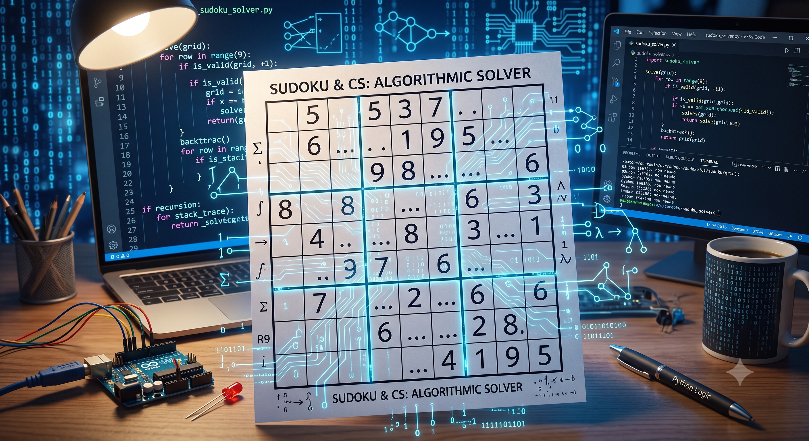
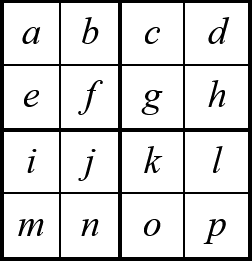
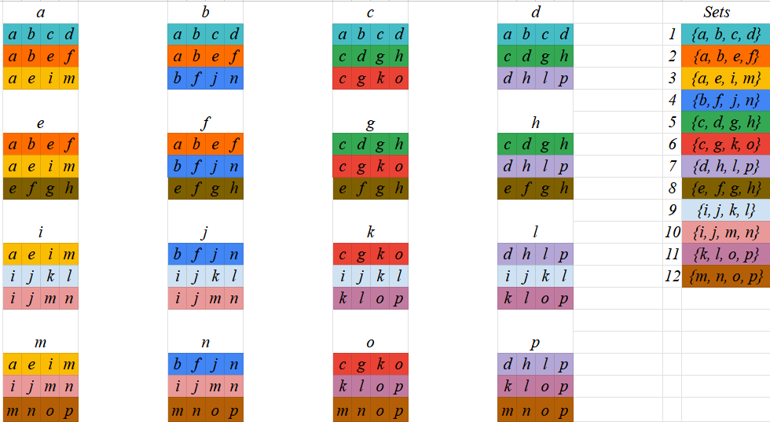

# How I Reduced Sudoku Backtracking by 98.99% Using Set Theory and Python  

**By Jonathan Scott** • *August 2026* • *8 min read*

---

Image generated with Google Gemini 3.1 

## The Possibility of the Impossible

While learning algorithms and data structures, I came across what the professor called the Sudoku Problem. The premise was straightforward: write an algorithm to solve any Sudoku puzzle. The classic brute-force approach simply looks for all blank spaces and enumerates every possible candidate. For an $n×n$ Sudoku puzzle, this creates a worst-case time complexity of $O(n^m)$, where $n$ is the number of possible digits, and $m$ represents the number of empty squares. The professor then challenged us to think of an algorithm with a worst-case time complexity better than that exponential mathematical bound.

What the professor casually "forgot" to mention is that finding an efficient, non-exponential solution to this problem is a famously unsolved mathematical dilemma.

In the next lecture, it was revealed that beating this worst-case scenario currently has no known solution in computer science. But because I had already started mapping out a way to solve it, I was too stubborn to let it go.

I started to analyze the difference between my personal strategy for solving a Sudoku puzzle and how a standard algorithmic solver does it. A naive algorithm blindly "guesses" outputs until it stumbles into the right board state. But when I solve a Sudoku puzzle, I only cross-reference three things: the row, the column, and the local sub-grid the target square sits in.

This idea made me start thinking in terms of Set Theory. To keep the math simple, I decided to test my logic on a $4×4$ puzzle before attempting to scale it up to a complex $9×9$ board.

## Mapping the Grid: A Set Theory Approach

To see if I could outsmart the brute-force approach on paper, I scaled the problem down to a $4×4$ grid. I assigned each square a variable from *a* to *p*:



When a person looks at square *a*, they don't test random numbers. They instantly cross-reference three physical constraints: its row, its column, and its local $2×2$ sub-grid.

Mathematically, this means square $a$ isn't floating in isolation; it lives strictly at the intersection of three distinct sets:

|                              |
|------------------------------|
|*Row Set 1 : {a, b, c, d}*    |
|*Column Set 3 : {a, e, i, m}* |
|*Box Set 2 : {a, b, e, f}*    |

By mapping every square on the $4×4$ board to its corresponding row, column, and sub-grid, I generated 12 fundamental constraint sets.



## Eliminating the Suspects

Now, this turns an exponential search into instant logical deduction. If square a is empty, we don't guess. We simply look at the known values inside its three intersecting sets:

|                  |
|------------------|
|*1 = {a, 4, 1, d}*|
|*2 = {a, 4, e, f}*|
|*3 = {a, e, 3, m}*|


By taking the union of these sets, we find that the values *{1, 3, 4}* are already claimed. Through pure set elimination, *a* must be *2*. No guessing, no branching, no CPU cycles wasted.

Applying this same elimination logic to square *d* cross-references sets 1, 5, and 7, instantly revealing that *d = 3*.
If every empty square on a board has a forced choice like this, the algorithm walks straight to the finish line in linear $O(m)$ time. But here is where I hit the mathematical wall: what happens when a square has more than one valid option left?

The moment logic runs out, and the algorithm is forced to guess between two numbers, the single linear timeline splits. We fall right back into the exponential nightmare of $O(n^m)$.

## The Transformers Epiphany: Global Awareness

To solve the problem, I needed a way to keep the algorithm in that linear $O(m)$ state for as long as possible before resorting to a guess.

That was when I thought about how Transformer architectures process information in modern machine learning. Instead of reading tokens sequentially one-by-one, transformers pay attention to the entire context globally before generating an output.

Standard Sudoku solvers are "locally blind"; they blindly process row 1 column 1, then row 1 column 2, regardless of how many empty spaces are in the way.

What if, instead of moving sequentially, the algorithm mapped the entire board state first on every iteration? By scanning all m empty spaces to find the square with the fewest remaining legal options (the Minimum Remaining Values heuristic), we could attack the tightest constraints first and collapse the decision tree before it ever has a chance to branch out.

(As I'd later learn, this is a well-established technique in constraint satisfaction known as the Minimum Remaining Values, or MRV, heuristic. I hadn't studied CSPs formally at that point, so arriving at it through the Transformers analogy felt like a genuine "aha", even though, as my AI collaborator pointed out, I was walking a well-trodden path in AI research.)

Paying a small polynomial "tax" of $O(m^2)$ to map the board upfront could potentially save us from exploring millions of dead ends later. Now, it was time to put this hypothesis to the test in Python.

## Translating Theory into Python (With an AI Peer)

With my set logic mapped out, I wanted to turn this hypothesis into a Python script. So I decided to use an AI collaborator not only to implement the logic, but to challenge my assumptions before a single line of code was executed.

I opened a Gemini 3.1 Pro terminal, laid out my set theory, and asked the model to stress-test my reasoning. When I first proposed that subset mapping could reduce the overall execution time toward a polynomial bound of $O(m^2)$, the model immediately pushed back, reminding me that Sudoku is NP-Complete, and that an adversarial board would still force an exponential branching tree of $O(n^m)$.

Instead of abandoning the idea, I walked the model through my reasoning: my point wasn't that we could magically break NP-Completeness, but that we could test how much of the exponential search space we could eliminate in practice.

Once the theoretical framework was aligned, I prompted the model to generate the implementation: 

- The Optimized MRV Solver: Implementing my subset logic, hash sets, and global board mapping.

```python
def _get_valid_options(self, r, c):
    # Constraint Propagation: Check the 3 subsets in O(1) time
    options = set(range(1, self.size + 1))
    box_idx = self._get_box_index(r, c)
    invalid_options = self.rows[r] | self.cols[c] | self.boxes[box_idx]

    # Return only the numbers that are NOT in the subsets
    return options - invalid_options
```

- The Classic Backtracker: A standard, brute-force solver to establish our baseline control group.

```python
def _is_valid(self, r, c, val):
    # Naive Validation: Loops through the arrays instead of using Hash Sets
    
    # Check row
    for i in range(self.size):
        if self.board[r][i] == val:
            return False
            
    # Check column
    for i in range(self.size):
        if self.board[i][c] == val:
            return False
            
    # Check 2x2 or 3x3 box
    box_row_start = (r // self.box_size) * self.box_size
    box_col_start = (c // self.box_size) * self.box_size
    for i in range(box_row_start, box_row_start + self.box_size):
        for j in range(box_col_start, box_col_start + self.box_size):
            if self.board[i][j] == val:
                return False
                
    return True
```

To measure the algorithmic efficiency independent of machine specs, CPU clock speeds, or background OS processes, I instrumented both solvers with a backtrack_count metric to track every single dead end the algorithms encountered.

## The Empirical Results Exceeded My Expectations.

I started by benchmarking both algorithms on two $4×4$ Sudoku puzzles: a standard puzzle to test basic correctness, and an empty board, expecting the empty board to force a worst-case scenario.

Both solvers handled the $4×4$ puzzles effortlessly, yielding *0* backtracks. As it turned out, a $4×4$ grid simply wasn't large enough to create deep search traps for either algorithm.

To really push the code to its limits, I scaled up to $9×9$ grids. I tested both solvers against an empty $9×9$ grid and a notoriously difficult $9×9$ adversarial puzzle designed to trigger heavy branching.

The contrast was staggering:

- The Classic Solver (Naive Backtracking): Returned *49,498* backtracks on the adversarial puzzle and *310* backtracks on the empty grid.

- My Optimized Solver (MRV + Hash Sets): Returned *1,608* backtracks on the adversarial puzzle and *0* backtracks on the empty grid.

Mathematically speaking, mapping constraints globally before guessing pruned the exponential decision tree by *96.75%* on the adversarial board.

## The Empty Board Phenomenon

The empty board result was particularly fascinating. Why did my algorithm achieve zero backtracks on a blank grid?

Because my solver uses Minimum Remaining Values (MRV) to map the full board at the start of every iteration, it never steps into a trap. With no pre-filled numbers to create distant contradictions, the algorithm simply drops valid numbers in sequence, generating a "lexicographically first" valid grid without hitting a single dead end.

Also, I executed both algorithms across multiple identical runs to verify that the results were fully deterministic. Every execution yielded the same backtrack counts, confirming that the performance leap was purely structural.

To test the algorithm, I built a 10-puzzle benchmark suite ranging from Easy to 17-clue Adversarial grids using Gemini 3.1 Pro. The empirical data exceeded all expectations: across all solvable boards, the optimized solver reduced backtracking cycles by an average of *98.99%*. 

|ID   | Difficulty    | Classic BT               | Opt BT    | Improvement |
|-----|---------------|--------------------------|-----------|-------------|
|1    | Easy          | 4157                     | 0         | 100.00%     |
|2    | Medium        | 9                        | 0         | 100.00%     |
|3    | Medium        | 879359                   | 3278      | 99.63%      |
|4    | Hard          | 78368                    | 913       | 98.83%	   |
|5    | Hard          | 8911                     | 186       | 97.91%	   |
|6    | Expert        | 6943131                  | 42200     | 99.39%	   |
|7    | Expert        | 49498                    | 1608      | 96.75%      |
|8    | Adversarial   | 69175252                 | 81917     | 99.88%      |
|9    | Adversarial   | 337                      | 5         | 98.52%	   |
|10   | Adversarial   | DNF / Timeout(>60 min)   | 10216605  | N/A         |


On the first *9* puzzles alone, the classic solver accumulated over *77* million dead ends, while the optimized solver sliced through the same boards with *130,000* total backtracks.

The ultimate test came with Puzzle #10. The classic algorithm ran on my Intel i7 CPU for over 60 minutes, locked in an exponential search tree, before I killed the process. The optimized algorithm, by continuously mapping board constraints globally, navigated the extreme grid and solved it in roughly 2 minutes, conquering 10.2 million backtracks that would have taken the naive solver hours to finish.

## What I learned

- Hardware Cannot Outrun Bad Complexity: Throwing faster CPUs or bigger cloud instances at an exponential problem is a temporary band-aid. Algorithmic efficiency and mathematical insight are what actually scale.

- Compounding Optimizations: Combining data-structure optimization $O(1)$ Hash Sets instead of $O(n)$ array loops with heuristic search pruning Minimum Remaining Values creates a massive compounding effect. The algorithm makes fewer decisions, and every decision it makes is infinitely cheaper (a combination well known in CSP solving, but one I arrived at independently).

- Pragmatic NP-Completeness: In the end, I didn't change the theoretical worst-case upper bound of $O(n^m)$; general Sudoku remains NP-Complete. But by understanding the mathematical constraints of the problem, my optimized solver bypassed *98.99%* of the computational nightmare in real-world execution.

- AI is a Collaborator, Not an Oracle: Generative AI is an incredible problem-solving accelerator, but using it without a deep understanding of the problem space can be counterproductive. If I had simply accepted the LLM's initial warning that beating exponential time complexity was impossible, this project would have ended on paper. Human domain intuition is what bridges the gap between theoretical bounds and practical optimization. 

---